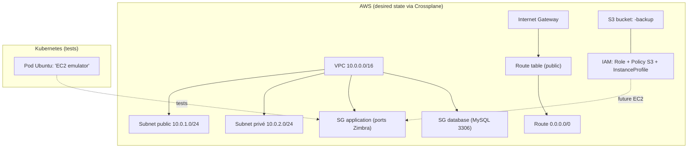

# IDP Zimbra AWS - Internal Developer Platform

Une plateforme en libre-service permettant aux administrateurs Zimbra de déployer automatiquement une infrastructure AWS complète pour Zimbra Collaboration Suite.

## ⚡ TL;DR

Ce dépôt expose un **claim Kubernetes** `Zimbra` (API `idp.example.com/v1alpha1`) qui déclenche Crossplane pour provisionner une plateforme Zimbra via une **Composition**.

- **Local (Kind + LocalStack)** : `crossplane/compositions/zimbra-platform-local.yaml`
- **AWS réel** : `crossplane/compositions/zimbra-platform-aws.yaml`

Guide rapide : `QUICKSTART.md`.

## 🎯 Vision du Projet

**Objectif** : Transformer le déploiement d'infrastructure Zimbra de 2 semaines de travail manuel en **1 fichier YAML + 10 minutes d'attente**.

### Avant l'IDP
- ⏰ 2 semaines de délai
- 👥 5 équipes impliquées (infra, réseau, sécurité, DB, compute)
- 🔧 Connaissance AWS/Terraform requise
- ❌ Erreurs de configuration fréquentes
- 🔑 Gestion manuelle des credentials

### Avec l'IDP
- ⏱️ 10 minutes d'attente
- 👤 1 admin Zimbra autonome
- 📝 Un simple fichier YAML
- ✅ Configuration standardisée et testée
- 🔐 Credentials auto-générés et injectés

---

## 🏗️ Architecture

### Stack Technologique

| Composant | Version | Rôle |
|-----------|---------|------|
| **Crossplane** | v1.17.1 | Orchestrateur d'infrastructure |
| **Kubernetes** | kind (local) | Plateforme de déploiement |
| **LocalStack** | latest | Simulation AWS en local (test) |
| **Providers Upbound AWS** | v1.x | Gestion ressources AWS (actuellement : S3/EC2/IAM) |
| **Provider Kubernetes** | v0.x | Création d’objets Kubernetes (Pods/StatefulSets/ConfigMaps/Secrets) |

### Concepts Crossplane utilisés

- **XRD** : définit `XZimbra` + le claim `Zimbra` (`crossplane/xrds/xzimbra.yaml`)
- **Compositions** :
  - `zimbra-platform-local` (`crossplane/compositions/zimbra-platform-local.yaml`, label `env: local-kind`)
  - `zimbra-platform` (`crossplane/compositions/zimbra-platform-aws.yaml`)

### API (claim `Zimbra`)

Champs principaux (voir `crossplane/xrds/xzimbra.yaml`) :

- **`spec.environment`** : `dev|staging|prod`
- **`spec.region`** : région AWS (défaut `us-east-1`)
- **`spec.storageSizeGB`** : quota backups S3 (défaut 50)
- **`spec.instanceType`** : gabarit EC2 visé (défaut `t3.medium`)
- **`spec.enableBackups`** : active/désactive la logique “backups” (défaut `true`)

### Infrastructure Créée (Phase 1 - POC)
```
┌─────────────────────────────────────────────────────────┐
│                      VPC 10.0.0.0/16                    │
│                                                         │
│  ┌────────────────────┐      ┌────────────────────┐   │
│  │  Subnet Public     │      │  Subnet Privé      │   │
│  │  10.0.1.0/24       │      │  10.0.2.0/24       │   │
│  │                    │      │                    │   │
│  │  ┌──────────────┐  │      │  ┌──────────────┐  │   │
│  │  │ EC2 Zimbra   │  │      │  │ RDS MySQL    │  │   │
│  │  │ (À venir)    │  │      │  │ (À venir)    │  │   │
│  │  └──────────────┘  │      │  └──────────────┘  │   │
│  └────────────────────┘      └────────────────────┘   │
│           │                                            │
│    Internet Gateway                                    │
└──────────────┬─────────────────────────────────────────┘
               │
        ┌──────┴──────┐
        │  S3 Bucket  │
        │   Backups   │
        └─────────────┘
```

### Ressources Actuellement Fonctionnelles

Cela dépend de la Composition sélectionnée :

- **Local (`zimbra-platform-local`)** :
  - ✅ S3 Bucket (via LocalStack)
  - ✅ MySQL StatefulSet (Kubernetes)
  - ✅ Pod Ubuntu “serveur” (Kubernetes) + sidecar OpenTelemetry Collector

- **AWS (`zimbra-platform`)** :
  - ✅ S3 Bucket
  - ✅ VPC + subnets + IGW + route table (+ assoc)
  - ✅ IAM Role + Policy + attachments + InstanceProfile (WIP pour une vraie instance EC2)
  - ✅ Security Groups + règles (ports Zimbra + MySQL)
  - ✅ Pod Ubuntu “EC2 emulator” dans Kubernetes (pour tests)

Non implémenté à date : provider RDS dédié, création d’une vraie EC2 Zimbra, base RDS managée, installation Zimbra end-to-end.

### Architecture AWS (état actuel / “desired state”)

⚠️ Cette section décrit **ce que la Composition AWS provisionnera** (le “desired state” défini dans `crossplane/compositions/zimbra-platform-aws.yaml`), **pas** un environnement déjà déployé/validé sur AWS.

#### Composants provisionnés par la composition AWS (actuel)

- **S3** : bucket de backups `"<claim>-backup"`
- **Réseau** : VPC `10.0.0.0/16`, 2 subnets (public `10.0.1.0/24`, privé `10.0.2.0/24`), Internet Gateway, route table publique + route `0.0.0.0/0` + association
- **IAM (préparation EC2)** : role assumable par EC2, policy d’accès S3 aux buckets `*-backup`, attachment, instance profile
- **Sécurité** : security groups + règles ingress (ports Zimbra) + règle MySQL 3306 depuis le SG “application” vers le SG “database”
- **Kubernetes (tests)** : un Pod Ubuntu “EC2 emulator” (outillage réseau/mysql-client), pour valider rapidement la connectivité

#### Non provisionné / à venir

- **EC2 Zimbra réelle** (instance + bootstrap / user-data)
- **RDS MySQL managé** (DB subnet group, instance, paramètres, snapshots)
- **Installation Zimbra end-to-end**

#### Schéma (simplifié)

Si ton hébergeur git ne rend pas Mermaid, voici une version ASCII :

```
AWS (desired state)
  VPC 10.0.0.0/16
   ├─ Subnet public 10.0.1.0/24 ── RouteTable(public) ── 0.0.0.0/0 ── IGW
   └─ Subnet privé  10.0.2.0/24

  S3 bucket: <claim>-backup
  IAM: Role + Policy S3 + InstanceProfile (préparation EC2)
  SG application (ports Zimbra) ──(source)──> SG database (MySQL 3306)

Kubernetes (tests)
  Pod Ubuntu "EC2 emulator"  -- tests -->  SG application
```



---

## 🚀 Installation et Configuration

### Prérequis

#### Logiciels Requis
```bash
# Docker
docker --version  # >= 20.x

# Kind (Kubernetes in Docker)
kind version  # >= 0.20.x

# kubectl
kubectl version --client  # >= 1.28.x

# Helm
helm version  # >= 3.x

# jq (requis par scripts/setup.sh)
jq --version

# AWS CLI (pour tests LocalStack)
aws --version  # >= 2.x

# LocalStack
docker pull localstack/localstack
```

#### VPN/Proxy (Important !)
⚠️ **Si vous utilisez MTN ou un FAI qui bloque CloudFront** :
```bash
# Installer Cloudflare WARP
# Instructions : https://developers.cloudflare.com/warp-client/get-started/linux/

# Activer WARP avant l'installation des providers
warp-cli registration new
warp-cli connect
```

---

### Installation Pas-à-Pas

#### 1. Démarrer LocalStack avec Persistance
```bash
# Créer le dossier de persistance
mkdir -p ~/localstack-data

# Lancer LocalStack
docker run -d \
  --name localstack \
  -p 4566:4566 \
  -e PERSISTENCE=1 \
  -e SERVICES=s3,ec2,rds,iam,vpc \
  -v ~/localstack-data:/var/lib/localstack \
  localstack/localstack

# Vérifier que LocalStack est healthy
docker ps | grep localstack
```

#### 2. Créer le Cluster Kind
```bash
# Créer le cluster
kind create cluster --name idp

# Vérifier
kubectl cluster-info
```

#### 3. Installer Crossplane v1.17.1
```bash
# Ajouter le repo Helm
helm repo add crossplane-stable https://charts.crossplane.io/stable
helm repo update

# Installer Crossplane
helm install crossplane crossplane-stable/crossplane \
  --namespace crossplane-system \
  --create-namespace \
  --version 1.17.1 \
  --wait

# Vérifier l'installation
kubectl get pods -n crossplane-system
```

#### 4. Installer les Providers AWS
```bash
cd ~/Documents/idp-zimbra-aws

# Activer WARP si nécessaire
warp-cli status

# Appliquer les providers
kubectl apply -f crossplane/providers/

# Surveiller l'installation (5-10 minutes)
kubectl get providers -w
# Attendre que tous soient HEALTHY=True
```

#### 5. Configurer les Secrets et ProviderConfig
```bash
# Créer le secret AWS (credentials fictives pour LocalStack)
kubectl create secret generic aws-creds \
  -n crossplane-system \
  --from-literal=creds='[default]
aws_access_key_id = test
aws_secret_access_key = test'

# Appliquer le ProviderConfig
kubectl apply -f platform/crossplane/provider-config.yaml

# AWS réel (sans LocalStack) : utiliser à la place
# kubectl apply -f platform/crossplane/provider-config-aws.yaml

# Vérifier
kubectl get providerconfig
kubectl get secret aws-creds -n crossplane-system
```

#### 6. Configurer les Permissions RBAC
```bash
# Appliquer les ClusterRoles et Bindings
kubectl apply -f platform/rbac/

# Vérifier
kubectl get clusterrole | grep providerconfig
kubectl get clusterrolebinding | grep provider-aws
```

#### 7. Déployer l'XRD et les Compositions
```bash
# Créer l'XRD Zimbra
kubectl apply -f crossplane/xrds/xzimbra.yaml

# Vérifier
kubectl get xrd

# Créer les Compositions (local + aws)
kubectl apply -f crossplane/compositions/zimbra-platform-local.yaml
kubectl apply -f crossplane/compositions/zimbra-platform-aws.yaml

# Vérifier
kubectl get composition
```

---

## 💻 Utilisation

### Créer une Instance Zimbra

#### 1. Choisir le claim (Local vs AWS)

- **Local** : `claims/dev-zimbra-local.yaml` (sélection via `spec.compositionSelector.matchLabels.env: local-kind`)
- **AWS** : `claims/dev-zimbra.yaml` (recommandé : définir explicitement `spec.compositionRef.name: zimbra-platform`)

#### 2. Appliquer le Claim
```bash
# Déployer l'infrastructure
kubectl apply -f claims/dev-zimbra.yaml

# Surveiller la création
kubectl get zimbra,xzimbra,bucket,vpc,subnet -w
```

#### 3. Vérifier l'État
```bash
# Voir le status du Claim
kubectl get zimbra dev-zimbra-001

# Détails complets
kubectl describe zimbra dev-zimbra-001

# Voir toutes les ressources créées
kubectl get bucket,vpc,subnet,internetgateway,routetable
```

#### 4. Vérifier dans LocalStack
```bash
# Configurer AWS CLI pour LocalStack
export AWS_ACCESS_KEY_ID=test
export AWS_SECRET_ACCESS_KEY=test
export AWS_DEFAULT_REGION=us-east-1

# Lister les buckets S3
aws --endpoint-url=http://localhost:4566 s3 ls

# Voir les VPCs
aws --endpoint-url=http://localhost:4566 ec2 describe-vpcs \
  --query 'Vpcs[*].[VpcId,CidrBlock,Tags[?Key==`Name`].Value|[0]]' \
  --output table
```

---

## 🔧 Troubleshooting

### Problème : Providers ne passent pas HEALTHY

**Symptôme** :
```bash
kubectl get providers
# HEALTHY=False après 10+ minutes
```

**Solutions** :
1. Vérifier les logs :
```bash
kubectl logs -n crossplane-system -l pkg.crossplane.io/provider=provider-aws-s3
```

2. Si erreur réseau/CloudFront :
```bash
# Activer WARP
warp-cli connect
warp-cli status

# Redémarrer les providers
kubectl delete pods -n crossplane-system -l pkg.crossplane.io/provider=provider-aws-s3
```

---

### Problème : Ressources en SYNCED=False

**Symptôme** :
```bash
kubectl get bucket
# SYNCED=False READY=False
```

**Diagnostic** :
```bash
# Voir l'erreur exacte
kubectl describe bucket <bucket-name>

# Logs du provider
kubectl logs -n crossplane-system -l pkg.crossplane.io/provider=provider-aws-s3
```

**Solutions courantes** :

1. **Erreur "forbidden" (RBAC)** :
```bash
# Vérifier les permissions
kubectl get clusterrolebinding | grep provider-aws

# Réappliquer les RBAC
kubectl apply -f platform/rbac/

# Redémarrer les providers
kubectl delete pods -n crossplane-system -l pkg.crossplane.io/provider
```

2. **Erreur liée à `ProviderConfigUsage`** :

Ce symptôme indique généralement un **mismatch de versions** Crossplane / provider Upbound ou une installation incomplète.

Actions rapides :

```bash
# Logs du provider fautif
kubectl get providers
kubectl logs -n crossplane-system -l pkg.crossplane.io/provider=provider-aws-s3

# Vérifier les CRDs installés côté provider
kubectl get crd | grep -i providerconfig
```

3. **LocalStack non accessible** :
```bash
# Vérifier LocalStack
docker ps | grep localstack

# Redémarrer si nécessaire
docker restart localstack

# Vérifier l'endpoint dans ProviderConfig
kubectl get providerconfig default -o yaml | grep endpoint
```

---

### Problème : AWS CLI ne peut pas accéder à LocalStack

**Symptôme** :
```bash
aws --endpoint-url=http://localhost:4566 s3 ls
# Unable to locate credentials
```

**Solution** :
```bash
# Configurer des credentials fictives
aws configure set aws_access_key_id test
aws configure set aws_secret_access_key test
aws configure set region us-east-1

# Ou via variables d'environnement
export AWS_ACCESS_KEY_ID=test
export AWS_SECRET_ACCESS_KEY=test
export AWS_DEFAULT_REGION=us-east-1
```

---

## 📊 État Actuel du Projet

### ✅ Fonctionnel (Phase 1 - POC)

| Composant | Status | Notes |
|-----------|--------|-------|
| Crossplane v1.17.1 | ✅ | Stable |
| Providers AWS (s3, ec2, iam) | ✅ | HEALTHY |
| Provider Kubernetes | ✅ | Pour objets K8s (pods/statefulsets/configmaps) |
| LocalStack | ✅ | Avec persistance |
| XRD Zimbra | ✅ | API définie |
| Compositions (local + aws) | ✅ | 2 compositions disponibles |
| Claims Zimbra | ✅ | Crée les ressources |
| RBAC Permissions | ✅ | Corrigées |
| S3 Buckets | ✅ | SYNCED + READY |
| VPC + Networking | ✅ | SYNCED + READY |

### ⏳ À Compléter (Phase 2)

| Composant | Priorité | Estimation |
|-----------|----------|------------|
| IAM Roles + Policies | 🔴 Haute | 2h |
| RDS Database (MySQL) | 🔴 Haute | 2h |
| EC2 Instance Ubuntu | 🔴 Haute | 3h |
| Security Groups | 🟡 Moyenne | 1h |
| User-data script Zimbra | 🟡 Moyenne | 2h |
| Status enrichi (IPs, endpoints) | 🟢 Basse | 1h |
| Documentation admin | 🟢 Basse | 2h |

---

## 🔮 Roadmap

### Phase 2 : Infrastructure Complète (En cours)
- [ ] Ajouter IAM Roles à la Composition
- [ ] Ajouter RDS Database
- [ ] Ajouter EC2 Instance
- [ ] Tester end-to-end sur LocalStack

### Phase 3 : Production-Ready
- [ ] Tester sur AWS réel (Free Tier)
- [ ] Ajouter monitoring (Prometheus/Grafana)
- [ ] Implémenter backup automation
- [ ] Documentation admin finale

### Phase 4 : Features Avancées
- [ ] Multi-région support
- [ ] High Availability (Multi-AZ)
- [ ] Auto-scaling
- [ ] Disaster Recovery

---

## 📁 Structure du Projet
```
idp-zimbra-aws/
├── README.md                       # Cette documentation
├── claims/                         # Claims utilisateur
│   ├── dev-zimbra.yaml             # Exemple AWS
│   └── dev-zimbra-local.yaml       # Exemple Local (compositionSelector)
├── crossplane/
│   ├── compositions/              # Compositions Crossplane
│   │   ├── zimbra-platform-aws.yaml
│   │   └── zimbra-platform-local.yaml
│   ├── providers/                 # Définitions des providers
│   │   ├── provider-aws-ec2.yaml
│   │   ├── provider-aws-iam.yaml
│   │   ├── provider-aws-s3.yaml
│   │   └── provider-kubernetes.yaml
│   └── xrds/                     # XRDs (API definitions)
│       └── xzimbra.yaml
├── infrastructure/               # Ressources standalone (test)
│   ├── s3-bucket.yaml
│   └── vpc.yaml
├── platform/
│   ├── crossplane/
│   │   ├── aws-secrets.yaml
│   │   ├── otel-collector-config.yaml
│   │   ├── provider-config-aws.yaml
│   │   └── provider-config.yaml  # Configuration LocalStack (Kind + LocalStack)
│   └── rbac/                     # Permissions RBAC
│       ├── provider-providerconfig-access.yaml
│       ├── provider-s3-binding.yaml
│       ├── provider-ec2-binding.yaml
│       ├── provider-iam-binding.yaml
└── scripts/                      # Scripts utilitaires
    ├── setup.sh
    └── fix-localstack-crossplane.sh
```

---

## 🤝 Contribution

### Debugging Réalisé

Ce projet a nécessité la résolution de multiples challenges :

1. **Blocage réseau MTN** → Solution : Cloudflare WARP
2. **Incompatibilité Crossplane v2 mode Pipeline** → Downgrade v1.17.1
3. **Permissions RBAC manquantes** → Création ClusterRoles manuels
4. **Provider-family-aws en conflit** → Utilisation providers modulaires uniquement

### Leçons Apprises

- Les providers modulaires Upbound v1.15 ont des incompatibilités avec Crossplane v1.17
- Les permissions RBAC ne sont pas auto-créées par le rbac-manager
- LocalStack nécessite `s3_use_path_style: true` + `endpoint` dans le `ProviderConfig` (S3/EC2/IAM)

### Sécurité & secrets (important)

- Ne commite jamais de **credentials AWS réelles** ni de **tokens** (ex: SigNoz).
- Pour l’OpenTelemetry Collector (`platform/crossplane/otel-collector-config.yaml`), la **clé d’ingestion SigNoz** doit être injectée via **Secret Kubernetes** (voir `QUICKSTART.md`).
